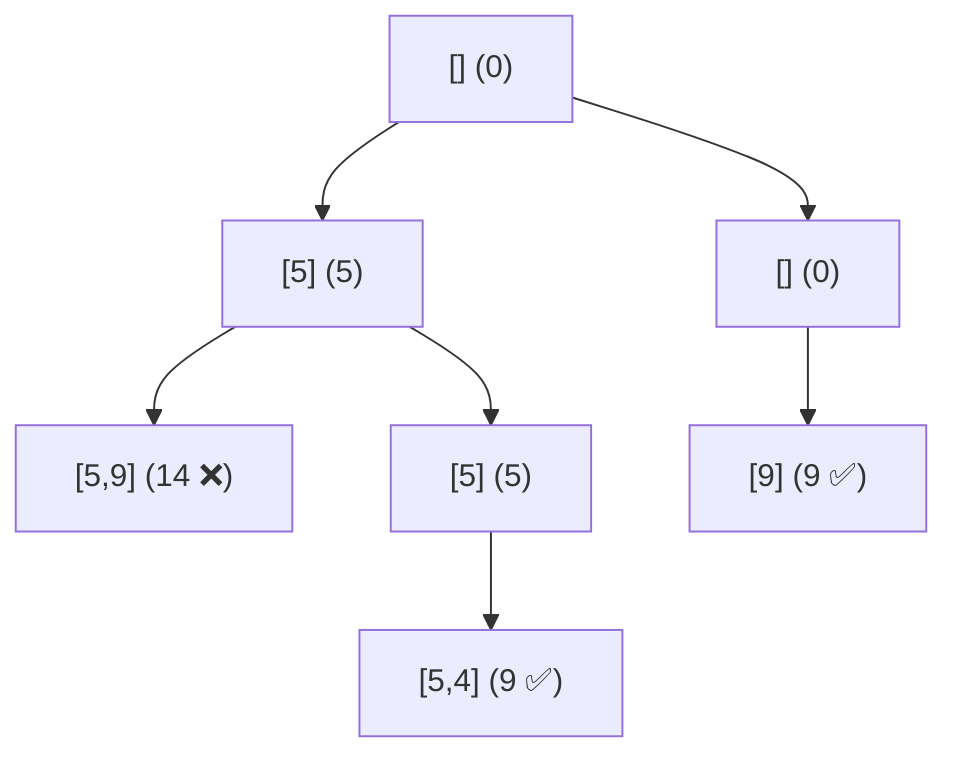

# 📘 Explanation: Subset Sum using Backtracking

## 🔍 Problem Understanding
We need to generate all subsets of an array such that the sum of elements equals a target value `k`.

---

## 🧠 Approach: Backtracking

Backtracking explores all possible combinations by making decisions at each step:

For every element, we have two choices:
1. Include the element
2. Exclude the element

---

## 🌳 Recursion Tree
 For nums = [5, 9, 4]:

We explore all possible paths.

---

## ⚙️ Algorithm Steps

1. Start from index 0 with:
   - total = 0
   - subset = []

2. At each index:
   - Include the element → add to subset and sum
   - Exclude the element → skip it

3. If total > k:
   - Stop (pruning optimization)

4. If index == len(nums):
   - Check if total == k
   - If yes → store the subset

---

## 🧪 Dry Run

Input:
nums = [5, 9, 4], k = 9

Steps:
- Include 5 → sum = 5
  - Include 9 → sum = 14 ❌ (stop)
  - Exclude 9 → include 4 → sum = 9 ✅ → [5,4]

- Exclude 5
  - Include 9 → sum = 9 ✅ → [9]

Final Output:
[[5,4], [9]]

---

## ⏱️ Complexity Analysis

### Time Complexity:
O(2^n)  
(Each element has 2 choices: include/exclude)

### Space Complexity:
O(n) (recursion stack)

---

## 🚀 Key Insights

- This is a classic **Backtracking + Subset Generation** problem
- Pruning (`total > k`) significantly improves performance
- Similar to:
  - Subsets (Power Set)
  - Combination Sum
  - Partition Problems
